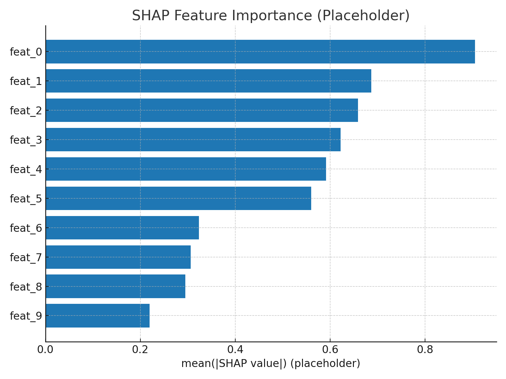

# 📊 Credit Risk Pro – UCI (LightGBM + Optuna + Calibración + SHAP)

Proyecto educativo de **riesgo crediticio** con el dataset **UCI Default of Credit Card Clients**.  
Incluye entrenamiento (LightGBM + Optuna + calibración), **umbral por costo**, explicabilidad **SHAP** y **app Streamlit**.

## ▶️ Demo
Ejecuta local: `streamlit run app.py`  
*(Si despliegas en Streamlit Cloud, pega aquí la URL cuando la tengas.)*

## 📈 Resultados
AUC/AP en `reports/metrics.json` (si subes el archivo).  
Imágenes (si las incluyes en `docs/`):




## 🗂️ Estructura

.
├─ app.py
├─ requirements.txt
├─ README.md
├─ models/ # lgbm_calibrated.joblib + threshold.txt
├─ docs/ # imágenes ROC/PR/SHAP (opcional)
└─ src/ # scripts de datos/entreno/predicción


## 🧪 Reproducibilidad (scripts)
```bash
# Descargar dataset (UCI) a data/raw
python src/download_kaggle.py --dataset uciml/default-of-credit-card-clients-dataset --out data/raw --unzip

# Preparar (split parquet)
python src/prepare_uci.py

# Entrenar (Optuna + Calibración + Umbral por costo)
python src/train.py --cost-fp 1.0 --cost-fn 5.0 --n-trials 30

# Predicción por lote
python src/predict.py --in data/processed/X_test.parquet --out predicciones.csv


